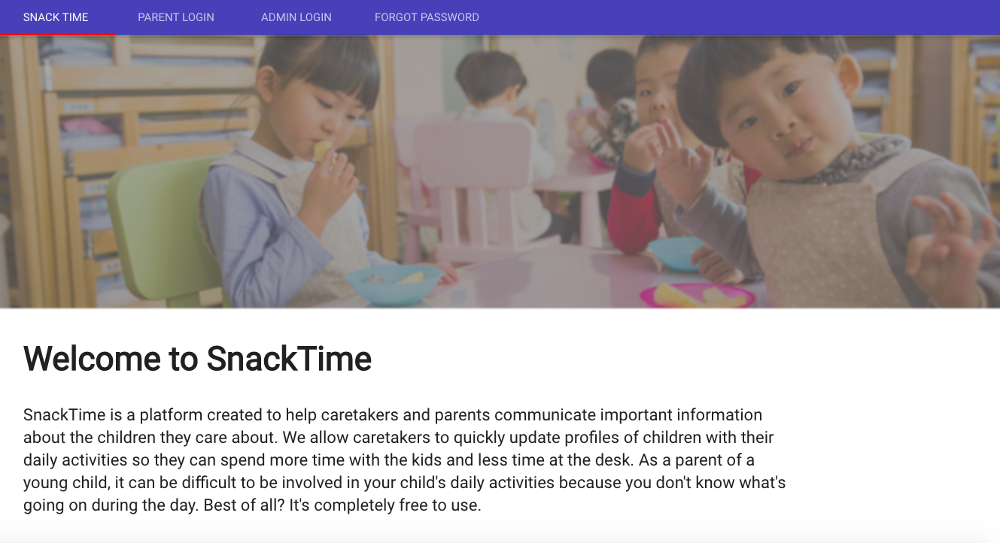
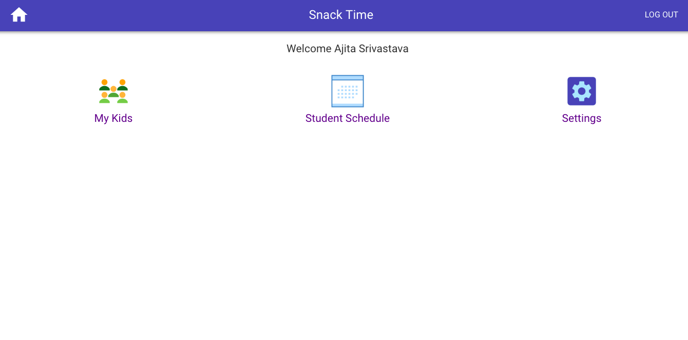
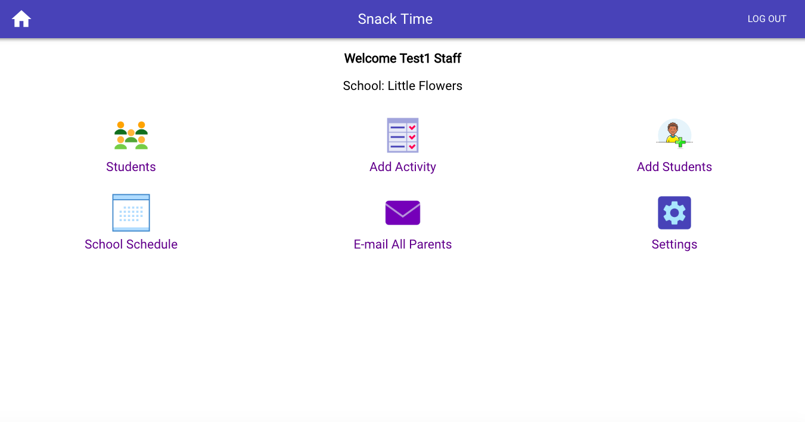
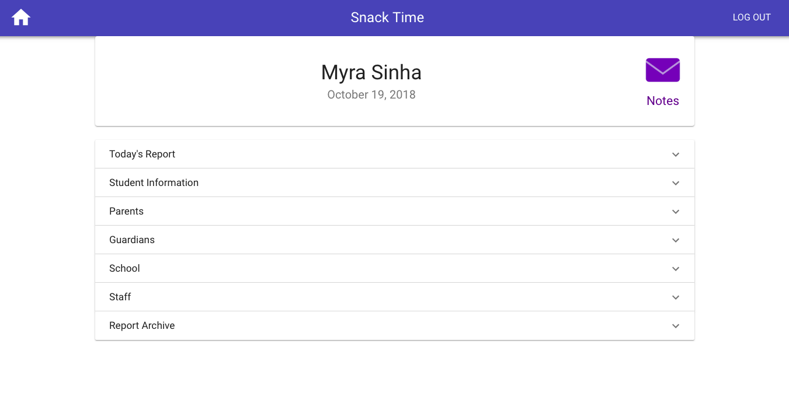
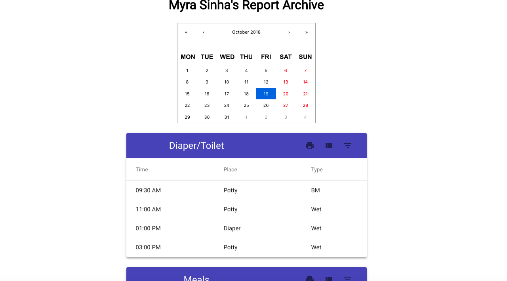
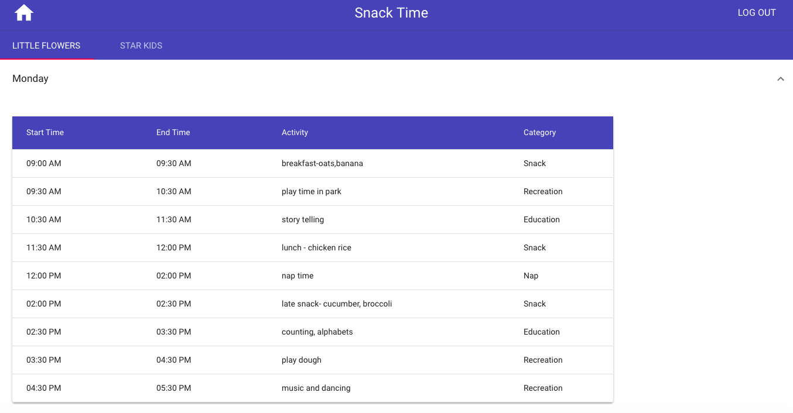
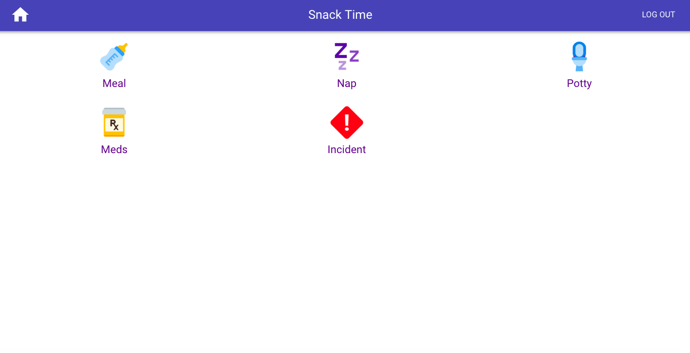
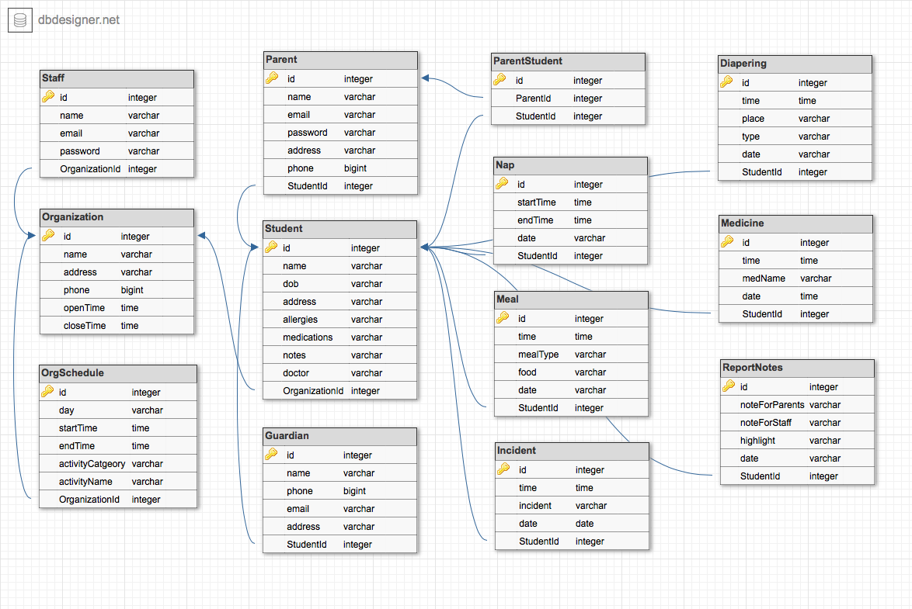

# SnackTime

## About

SnackTime is a full-stack application built on MVC architecture that provides a communication platform between Child Care Providers and Parents. It is built on SQL-Express-React-Node stack.

## Target Users

### Child Care Providers/Pre-Schools

It enables care providers to maintain day-to-day activity history of students, information of parents, guardians, organization schedule.

### Parents

Parents can maintain a history of all reports for their kids from their respective care providers/schools. They can also access school and staff members public information like staffs' emails and school schedule.

## Deployed Link

[SnackTime](Snacktimedeployment.herokuapp.com)

## Application Preview

### Welcome Page



### Parent HomePage



### Staff HomePage



### Student Page



### Student Report Archive



### Org Schedule



### Add Activity to report




## Technologies used

1. React.js
2. Node.js
3. Express.js
4. Sequelize with MySQL dialect
5. NodeMailer
6. BCrypt to store encrypted passwords

## Node/React Packages/Libraries used

### Server Side

1. [nodemailer](https://nodemailer.com/about/)
2. [bcrypt-nodejs](https://www.npmjs.com/package/bcrypt-nodejs)
3. [express.js](https://expressjs.com/)
4. [express-router](https://www.npmjs.com/package/express-router)
5. [express-session](https://www.npmjs.com/package/express-session)
6. [.env](https://www.npmjs.com/package/dotenv)
7. [moment.js](https://momentjs.com/)
8. [Sequelize](http://docs.sequelizejs.com/)
9. [shortid](https://www.npmjs.com/package/shortid)


### Client Side

1. [@material-ui/core](https://material-ui.com/)
2. [react](https://reactjs.org/docs/react-api.html)
3. [react-calendar](https://www.npmjs.com/package/react-calendar)
4. [react-dom](https://reactjs.org/docs/react-dom.html)
5. [react-scripts](https://www.npmjs.com/package/react-scripts)
6. [mui-datatables](https://www.npmjs.com/package/mui-datatables)
7. [@material-ui/icons](https://material-ui.com/style/icons/)
8. [moment.js](https://momentjs.com/)

## Models



## Code snippets

### server

The code below is how we set up some of the variables used in our server.

```js
const express = require("express");
const session = require("express-session");
const app = express();
const routes = require("./routes");
const db = require("./models");
```

The code below sets up our server to run Express Sessions. Sessions keeps track of which user is currently using our website and we later use this session for authentication.

```js
app.use(
  session({
    key: "user_sid",
    secret: "secret",
    resave: false,
    saveUninitialized: false,
    path: "/",
    cookie: {
      expires: 600000
    }
  })
);
```

The code below sets up our server to interact with the Sequelize ORM and MySql database.

```js
db.sequelize.sync({ force: false }).then(function() {
  app.listen(PORT, function() {
    console.log(`🌎  ==> API Server now listening on PORT ${PORT}!`);
  });
});
```

### view

<!-- Ajita Start-->
Report Archive page is used by both parents and staffs. React's modularity allowed us to reuse this particluar page.

As the user changes the date in calendar, below function is triggered.
```js
onChange = date => {
    this.setState({ date }, function () {
      let date =
        this.state.date.getFullYear() +
        '-' +
        (this.state.date.getMonth() + 1) +
        '-' +
        this.state.date.getDate();
      console.log("Date: ", date);
      fetch(`api/student/${this.state.studentId}/reportconsolidated/${date}`)
        .then(res => res.json())
        .then(res => this.setState({ report: res }, function () {
          if (res.Meals.length > 0 || res.Diaperings.length > 0 || res.Incidents.length > 0 || res.Medicines.length > 0 || res.Naps.length > 0 || res.Reports.length > 0)
            this.setState({ reportExists: true })
          else
            this.setState({ reportExists: false })
        }))
    })
  }
```

Rendering the report sections on the page once the date is picked on calendar by user.
```js
  renderFullReport = () => {
    if (!this.state.reportExists)
      return (<div><p>No report available for selected date</p></div>)
    else {
      return (
        <div>
          {this.renderNotesForStaff()}
          {this.renderNotesForParents()}
          {this.renderHighlight()}
          {this.renderDiaperings()}
          {this.renderMeals()}
          {this.renderNaps()}
          {this.renderMeds()}
          {this.renderIncidents()}
        </div>
      )
    }
  }
```

For organization schedule, a parent needs to see schedules for all the orgs his kids go to. For this purpose, there are tabs for all relavant organizations. On click of each tab, it shows weekly schedule of the selected organization.

```js
render() {
    const { classes } = this.props;
    const { value } = this.state;

    if (this.state.loggedIn && this.state.hasOrgs) {
    return (
      <div className={classes.root}>
      <HeaderBar type="parent"/>
        <AppBar position="static">
          <Tabs value={value} onChange={this.handleChange}>
          {this.state.allOrgs.map(org=> <Tab label={org.name} />)}
          </Tabs>
        </AppBar>
        {this.state.allOrgs.map((org,index)=>{
            if(value === index)
                return(
                <TabContainer>
                    {this.state.days.map(day=>
                        <ExpansionPanel key={day}>
                        <ExpansionPanelSummary expandIcon={<ExpandMoreIcon />}>
                            <Typography className={classes.heading}>
                                {day}
                            </Typography>
                        </ExpansionPanelSummary>
                        <ExpansionPanelDetails>
                            <DaySchedule day={day} orgId={org.id} role="parent" />
                        </ExpansionPanelDetails>
                    </ExpansionPanel>
                    )}
                </TabContainer>
                )
        })}
        </div>
        )}
```
<!--Ajita End-->
<!-- Taylor Start-->

<!--Taylor End-->
<!-- Brian Start-->

<!--Brian End-->
<!-- Bryan Start-->
React allowed us to build one page out of many smaller components. This allowed us to all work on different components and use them else where on our application. For example, we have this responsive table from [MUI-datatables](https://www.npmjs.com/package/mui-datatables).

We can pass in the data that fills the table as props from the component that holds the tables. This allows us to reuse this table on any page we need to display a table.

```js
class ResponsiveTable extends React.Component {
  getMuiTheme = () =>
    createMuiTheme({
      overrides: {
        MUIDataTableToolbar: {
          root: {
            backgroundColor: "#3f51b5",
            borderTopLeftRadius: "4px",
            borderTopRightRadius: "4px"
          }
        },
        MuiTypography: {
          title: {
            color: "#FFF"
          }
        },
        MuiTableRow: {
          root: {
            "& td:last-child": {
              paddingRight: "56px"
            }
          }
        }
      }
    });

  render() {
    return (
      <div>
        <MuiThemeProvider theme={this.getMuiTheme()}>
          <MUIDataTable
            title={this.props.title}
            data={this.props.data}
            columns={this.props.columns}
            options={options}
          />
        </MuiThemeProvider>
        <br />
      </div>
    );
  }
}

export default ResponsiveTable;
```
Components allow us to do something like this. Each table takes in a different prop title, columns, and data. The code for the table can be reused without having to type it out again.
```js
<ResponsiveTable
  title="Incidents"
  columns={["Time", "Incident"]}
  data={this.state.incidentData}
/>
<ResponsiveTable
  title="Medicines Administered"
  data={this.state.medicineData}
  columns={["Time", "Medicine"]}
/>
<ResponsiveTable
  title="Naps"
  data={this.state.napData}
  columns={["Start Time", "End Time"]}
/>
```
<!--Bryan End-->

### Controller

Below are few of the controller functions used in this app. Three major sections in these apps are: Staff functions, Parent functions and authorization functions.

#### Staff and Parent Controller functions

The function below gets us all parents' emails belonging to an organization. This means finding parents whose kids belong the given organization.

```js
  getAllParentsEmail: function (req, res) {
    db.Parent.findAll({
      attributes: ["email"],
      include: [
        {
          model: db.Student,
          where: { OrganizationId: req.params.orgId },
          attributes: ["id"]
        }
      ]
    }).then(dbStudents => {
      console.log(dbStudents);
      res.json(dbStudents);
    });
  },
```

Below given function will give us back a consolidated report of a student for a particular date.

```js
getReportConsolidated: function (req, res) {
    console.log("Req ", req.params);
    db.Student.findOne({
      where: {
        id: req.params.studentId
      },
      include: [{
        model: db.Meal,
        required: false,
        as: 'Meals',
        where: { date: req.params.date }
      },
      {
        model: db.Diapering,
        required: false,
        as: 'Diaperings',
        where: { date: req.params.date }
      },
      {
        model: db.Nap,
        required: false,
        as: 'Naps',
        where: { date: req.params.date }
      },
      {
        model: db.Incident,
        required: false,
        as: 'Incidents',
        where: { date: req.params.date }
      },
      {
        model: db.Medicine,
        required: false,
        as: 'Medicines',
        where: { date: req.params.date }
      },
      {
        model: db.Report,
        required: false,
        as: "Reports",
        where: { date: req.params.date }
      }]
    })
      .then(dbStudent => {
        console.log("DB STUDENT", dbStudent);
        res.json(dbStudent);
      })
      .catch(err => res.status(422).json(err));
  },
```

Below code is executed in order to send mass emails to parents of the organization.
```js
emailParents: function (req, res) {
    try {
      var transporter = nodemailer.createTransport({
        service: "gmail",
        type: "SMTP",
        host: "smtp.gmail.com",
        secure: true,
        auth: {
          user: "snacktimeemail@gmail.com",
          pass: process.env.EMAIL_PASSWORD
        }
      });
      let mailOptions = {
        subject: `Snack Time | ${req.body.subject}`,
        bcc: req.body.emails,
        from: `Snack Time <snacktimeemail@gmail.com>`,
        html: `
          <h4>Greetings Parent!</h4>
          <p>${req.body.body}</p>
          <h4>Thanks! Snack Time Team</h4>`
      };
      transporter.sendMail(mailOptions, function (error, info) {
        if (error) {
          console.log(error);
        } else {
          console.log("Email sent: " + info.response);
          res.json("Please check your email.");
        }
      });
    } catch (error) {
      console.log("email failed");
    }
  },
```

Below code is used to find all different organizations a parent's kids go to.
```js
getAllStudentOrgs: function(req,res){
      db.Organization.findAll({
        attributes:["id","name"],
        include : [{
            model: db.Student,
            attributes:["id"],
            include:[{
                model:db.Parent,
                attributes:["id"],
                where:{
                    id:req.params.parentId
                }
            }]
        }],
      })
      .then(dbOrgs => res.json(dbOrgs))
      .catch(err => res.status(422).json(err));
  }
```

#### Authentication controller functions

The code below is the route we would hit when we sign up a new staff. The front end will do a post call with the required data, then we would create a new staff model in the database and store the new user in the express session.

```js
router.route("/signup/staff").post((req, res) => {
  db.Staff.create({
    name: req.body.name,
    email: req.body.email,
    password: req.body.password,
    OrganizationId: req.body.orgId
  })
    .then(staff => {
      req.session.user = staff.dataValues;
      let { email, id, name } = req.session.user;
      let obj = { email, id, name };
      res.json(obj);
    })
    .catch(error => {
      res.send(error);
    });
});
```

The code below is for logging in a user. The front end does a post route with the correct data and we find the user with the email. We then check their password with the stored hashed password and we either log them in, or we inform them that they have entered an incorrect password.

```js
router.route("/login/:role").post((req, res) => {
  var email = req.body.email,
    password = req.body.password;
  let role = req.params.role;
  db[role].findOne({ where: { email: email } }).then(function(user) {
    if (!user) {
      res.send("Email does not exist in our database");
    } else if (!user.validPassword(password)) {
      res.send("Incorrect Password");
    } else if (user.validPassword(password)) {
      req.session.user = user.dataValues;
      res.send("Success");
    }
  });
});
```

The code below is an example of how we would use nodemailer. If a user forgets their password, they can enter their email in a form and we issue them a reset key. We then send them an email with the reset key and they can reset their password. We make sure to check the reset key is the same one as the one we set in the database and we make sure the key has not expired yet.

```js
router.post("/forgot/:role", (req, res) => {
  let role = req.params.role;
  let { email, baseUrl } = req.body; // same as let email = req.body.email
  let passResetKey = shortid.generate();
  let passKeyExpires = new Date().getTime() + 20 * 60 * 1000;
  db[req.params.role]
    .findOne({
      where: {
        email: email
      }
    })
    .then(user => {
      user
        .update({
          passResetKey: passResetKey,
          passKeyExpires: passKeyExpires
        })
        .then(() => {
          var transporter = nodemailer.createTransport({
            service: "gmail",
            type: "SMTP",
            host: "smtp.gmail.com",
            secure: true,
            auth: {
              user: "snacktimeemail@gmail.com",
              pass: process.env.EMAIL_PASSWORD
            }
          });
          let mailOptions = {
            subject: `Snack Time | Password reset`,
            to: email,
            from: `Snack Time <snacktimeemail@gmail.com>`,
            html: `
                <h1>Hi, ${user.name}</h1>
                <h2>Click the link below to reset your password.</h2>
                <h2><code contenteditable="false" style="font-weight:200;font-size:1.5rem;padding:5px 10px; background: #EEEEEE; border:0"><a href='${baseUrl}resetpassword/${role}/${passResetKey}'>Click here to reset your password.</a></code></h2>
                <p>Please ignore if you didn't try to reset your password on our platform</p>`
          };
          transporter.sendMail(mailOptions, function(error, info) {
            if (error) {
              console.log(error);
            } else {
              console.log("Email sent: " + info.response);
              res.json("Please check your email.");
            }
          });
        });
    });
});
```

## Learning points

1. Creating a full stack web application.
2. Learning how the server and client interact with requests and responses.
3. How to create a server and how it starts listening for the clients' requests on a particular port.
4. How the models, controllers and views interact in MVC architecture.
5. Various types of ajax client requests i.e post,get,put,delete to database server
6. How to query on database using a req.body or req.params
7. Using sequelize package to interact with mysql server. This included creating connection, reading, updating, creating, deleting data using sequelize methods.
8. How to re-use modular React components.
9. Deploying application on heroku.

## Authors

- [Ajita Srivastava Github](https://github.com/ajitas) | [Ajita Srivastava Portfolio](https://ajitas.github.io/Portfolio/)

- [Taylor Skeels Github](https://github.com/skeeis) | [Taylor Skeels Portfolio](https://skeeis.github.io/Personal-Portfolio/)
  <!-- Brian please add your info -->
- [Brian Qian Github]() | [Brian Qian Portfolio]()

- [Bryan Liang Github](https://github.com/liangbryan2) | [Bryan Liang Portfolio](https://liangbryan2.github.io/Portfolio/)

## License

Standard MIT License
